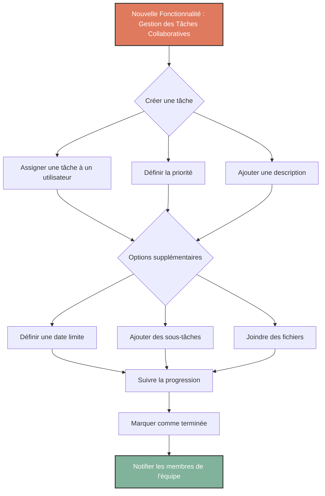

Nous sommes ravis de vous présenter notre toute nouvelle fonctionnalité : **Gestion des Tâches Collaboratives** ! 🎉 Avec cette mise à jour, nous facilitons la coordination et le suivi des projets au sein de vos équipes. Voici comment ça fonctionne :
<!-- truncate -->
## 🚀 Qu'est-ce que la Gestion des Tâches Collaboratives ?
Cette fonctionnalité permet aux utilisateurs de créer, assigner et suivre des tâches dans un environnement collaboratif. Idéale pour les équipes travaillant sur des projets communs, elle offre une gestion fluide et structurée du travail, assurant que chaque tâche soit bien prise en charge et suivie jusqu'à sa complétion.

## 🏗️ Fonctionnalités principales
- **Création de tâches simplifiée** : Ajoutez rapidement de nouvelles tâches avec des descriptions détaillées, des assignations et des priorités.
- **Suivi des tâches en temps réel** : Visualisez la progression de chaque tâche et recevez des notifications pour les mises à jour importantes.
- **Collaboration fluide** : Joignez des fichiers, ajoutez des commentaires, et collaborez directement sur chaque tâche.

## 📊 Diagramme de flux de la fonctionnalité

### Explications des changements :
- **`theme: "dark"`** : Active le thème sombre par défaut de Mermaid.
- **`themeVariables`** : Te permet de personnaliser les couleurs, comme :
  - `primaryColor`, `tertiaryColor`, etc. pour les différentes teintes utilisées dans le diagramme.
  - `nodeTextColor` pour s'assurer que le texte soit visible en blanc.
  - `edgeLabelBackground` pour changer la couleur d'arrière-plan des étiquettes sur les flèches.
  - `fontFamily` pour choisir la police.

### Astuce supplémentaire :
Si tu souhaites ajuster encore plus les styles par défaut, tu peux créer un fichier CSS Mermaid personnalisé et l'importer via ton fichier `docusaurus.config.js`. Cette approche te donne un contrôle total sur les couleurs et le style des diagrammes.

Essaie avec ce code et dis-moi si ça améliore le rendu ! 😊
